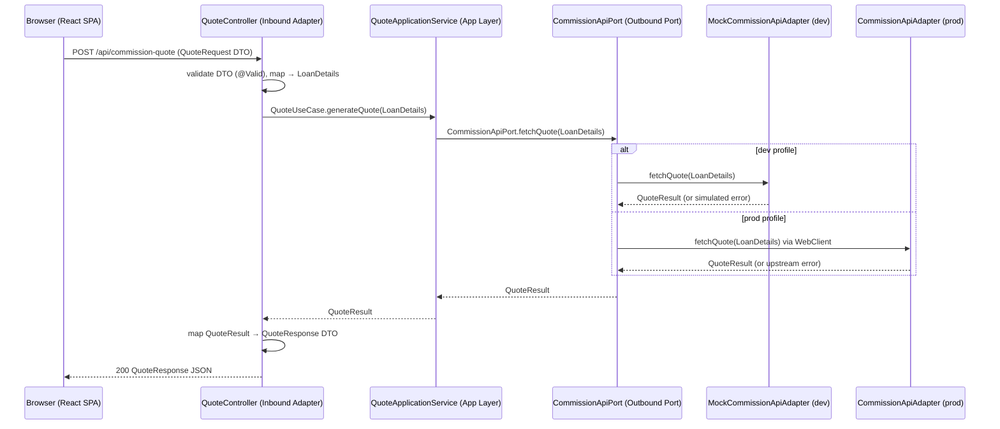
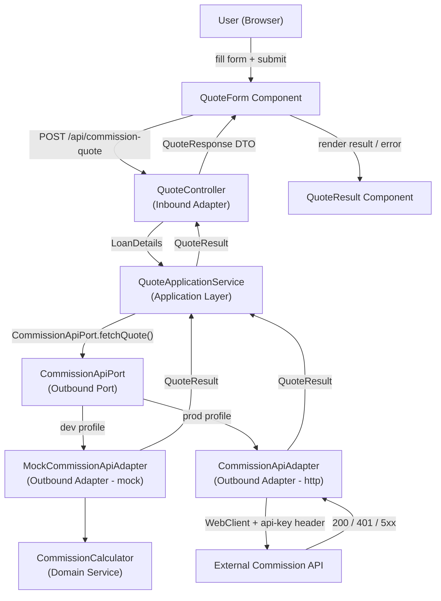

# Design Document: Commission Quote App

## Overview

The Commission Quote App is a full-stack web application composed of:

- A **React (Vite)** single-page application for the user interface
- A **Spring Boot 3.x (Kotlin)** backend structured around **Domain-Driven Design (DDD)** with a **Hexagonal Architecture (Ports and Adapters)**
- A **Mock outbound adapter** (`MockCommissionApiAdapter`) that implements the outbound port and is active only under the `dev` Spring profile

Users fill in a loan details form; the frontend sends a `POST /api/commission-quote` to the Spring Boot inbound adapter, which maps the HTTP request into the domain, invokes the application service through the inbound port, which in turn calls the outbound port to reach the (real or mock) Commission Quote API. The result (or error) is mapped back to an HTTP response and rendered to the user.

---

## Bounded Context

There is a single bounded context in this application: **Quote** (commission quote generation).

All domain objects, services, ports, and adapters exist within this context. No cross-context communication is required.

---

## Architecture

### Hexagonal Architecture Overview

The backend follows the Ports and Adapters pattern. The domain and application layers have zero dependency on Spring, HTTP, or any infrastructure framework. Infrastructure concerns are pushed to the adapter layer.

```
┌────────────────────────────────────────────────────────────────────┐
│                        Adapter Layer                               │
│                                                                    │
│  ┌──────────────────────┐       ┌──────────────────────────────┐  │
│  │  Inbound Adapter     │       │  Outbound Adapters           │  │
│  │  (web)               │       │  (http / mock)               │  │
│  │  QuoteController     │       │  CommissionApiAdapter        │  │
│  │  QuoteRequest DTO    │       │  MockCommissionApiAdapter    │  │
│  │  QuoteResponse DTO   │       │  (@Profile("dev"))           │  │
│  └────────┬─────────────┘       └──────────────┬───────────────┘  │
│           │ calls                               │ implements        │
├───────────▼─────────────────────────────────────▼──────────────────┤
│                    Application Layer                                │
│                                                                    │
│  ┌──────────────────────────────────────────────────────────────┐  │
│  │  QuoteApplicationService                                     │  │
│  │  implements QuoteUseCase (inbound port)                      │  │
│  │  injects CommissionApiPort (outbound port)                   │  │
│  └──────────────────────────────────────────────────────────────┘  │
├────────────────────────────────────────────────────────────────────┤
│                       Domain Layer                                 │
│                                                                    │
│  ┌─────────────────┐  ┌─────────────────┐  ┌──────────────────┐  │
│  │  LoanDetails    │  │  QuoteResult    │  │  RiskBand        │  │
│  │  (Value Object) │  │  (Value Object) │  │  (Enum + mult.)  │  │
│  └─────────────────┘  └─────────────────┘  └──────────────────┘  │
│                                                                    │
│  ┌──────────────────────────────────────────────────────────────┐  │
│  │  CommissionCalculator  (Domain Service — pure function)      │  │
│  └──────────────────────────────────────────────────────────────┘  │
│                                                                    │
│  ┌───────────────────────┐   ┌──────────────────────────────┐     │
│  │  QuoteUseCase         │   │  CommissionApiPort           │     │
│  │  (Inbound Port)       │   │  (Outbound Port)             │     │
│  └───────────────────────┘   └──────────────────────────────┘     │
└────────────────────────────────────────────────────────────────────┘
```

### High-Level Request Flow



### Component Interaction (Mermaid)



### Deployment Topology

In development (`SPRING_PROFILES_ACTIVE=dev`):
- Spring Boot runs on port 8080
- `MockCommissionApiAdapter` is injected as the `CommissionApiPort` bean (no HTTP call is made)
- The Vite dev server runs on port 5173 and proxies `/api/*` to `http://localhost:8080`

In production the `dev` profile is inactive and `CommissionApiAdapter` (real WebClient implementation) is injected instead.

**Profile configuration files:**

- `server/src/main/resources/application.yml` — base config; defines `commission.api.url` with a placeholder (e.g. `https://api.example.com/commission-quote`) for prod use; sets `spring.profiles.active: dev` for local development default
- `server/src/main/resources/application-dev.yml` — dev-specific overrides; contains a note: "Not used in dev — MockCommissionApiAdapter is injected directly; no HTTP call is made" (the `commission.api.url` property is effectively unused when the dev profile is active)

---

## Components and Interfaces

### Backend Package Structure

```
server/src/main/kotlin/com/example/commissionquote/
├── config/
│   ├── AppConfig.kt                    -- WebClient bean + COMMISSION_API_KEY env var validation
│   └── OpenApiConfig.kt                -- OpenAPI global info bean
├── domain/
│   ├── model/
│   │   ├── LoanDetails.kt              -- Value Object
│   │   ├── QuoteResult.kt              -- Value Object
│   │   └── RiskBand.kt                 -- Enum with multiplier
│   ├── service/
│   │   └── CommissionCalculator.kt     -- Domain Service (@Service, pure function logic)
│   └── port/
│       ├── inbound/
│       │   └── QuoteUseCase.kt         -- Inbound Port (interface)
│       └── outbound/
│           └── CommissionApiPort.kt    -- Outbound Port (interface)
├── application/
│   └── QuoteApplicationService.kt     -- Implements QuoteUseCase
├── adapter/
│   ├── inbound/
│   │   └── web/
│   │       ├── QuoteController.kt      -- @RestController POST /api/commission-quote
│   │       ├── QuoteRequest.kt         -- HTTP request DTO
│   │       ├── QuoteResponse.kt        -- HTTP response DTO
│   │       └── ErrorResponse.kt        -- Error response DTO (adapter layer only)
│   └── outbound/
│       ├── http/
│       │   └── CommissionApiAdapter.kt -- Real WebClient implementation
│       └── mock/
│           └── MockCommissionApiAdapter.kt -- @Profile("dev") mock
└── CommissionQuoteApplication.kt
```

### Domain Layer

#### `RiskBand` — Enum (Value)

A sealed enum that encodes the valid risk categories and their associated commission multipliers. Construction from a raw string validates the value and throws `IllegalArgumentException` for unrecognised inputs.

#### `LoanDetails` — Value Object

Immutable. Equality by value. Validated at construction:
- `loanAmount > 0` — throws `IllegalArgumentException` if not
- `loanTermMonths > 0` — throws `IllegalArgumentException` if not
- `riskBand` must be a valid `RiskBand` (enforced by `RiskBand.from()`)

#### `QuoteResult` — Value Object

Immutable. Holds `quoteId: String`, `commission: Double`, `totalRepayable: Double`. No construction-time validation beyond Kotlin's non-null constraints.

#### `CommissionCalculator` — Domain Service

Stateless, pure function. `fun calculate(details: LoanDetails): Pair<Double, Double>` — returns `(commission, totalRepayable)`. Annotated with `@Service` for Spring bean registration so that `MockCommissionApiAdapter` can constructor-inject it. The `@Service` annotation is a registration hint only — the logic itself has no Spring coupling or I/O.

```
commission      = loanAmount × riskBand.multiplier × (loanTermMonths / 12.0)
totalRepayable  = loanAmount + commission
```

#### `QuoteUseCase` — Inbound Port

```kotlin
interface QuoteUseCase {
    fun generateQuote(details: LoanDetails): QuoteResult
}
```

#### `CommissionApiPort` — Outbound Port

```kotlin
interface CommissionApiPort {
    fun fetchQuote(details: LoanDetails): QuoteResult
}
```

### Application Layer

#### `QuoteApplicationService`

Implements `QuoteUseCase`. Constructor-injected with `CommissionApiPort` and the API key config value.

Responsibilities:
1. Guard: if API key is blank → throw a configuration exception (mapped to HTTP 500 by `@ExceptionHandler`)
2. Delegate to `commissionApiPort.fetchQuote(details)`
3. Return `QuoteResult`

No Spring-specific concerns except `@Service` stereotype and `@Value` injection.

### Adapter Layer — Inbound

#### `QuoteController` (`adapter/inbound/web/`)

- `@RestController`
- `POST /api/commission-quote`
- Accepts `@RequestBody @Valid QuoteRequest` DTO
- Maps `QuoteRequest` → `LoanDetails` (calls `RiskBand.from()`, which throws `IllegalArgumentException` for invalid risk band)
- Calls `quoteUseCase.generateQuote(loanDetails)`
- Maps `QuoteResult` → `QuoteResponse` DTO
- `@ExceptionHandler` for:
  - `IllegalArgumentException` → HTTP 400 `{ "error": "..." }`
  - Configuration exception → HTTP 500 `{ "error": "Server configuration error" }`
  - Upstream 401 exception → HTTP 401 `{ "error": "Unauthorised — check API key" }`
  - Upstream 5xx exception → HTTP 502 `{ "error": "Commission API error" }`
  - Timeout exception → HTTP 504 `{ "error": "Request timed out" }`
  - Invalid upstream shape exception → HTTP 502 `{ "error": "Invalid response from API" }`

#### `QuoteRequest` DTO

```kotlin
data class QuoteRequest(
    @field:NotNull @field:Positive
    @Schema(description = "Loan amount in dollars", example = "50000.0", minimum = "0.01")
    val loanAmount: Double?,

    @field:NotNull @field:Positive
    @Schema(description = "Loan term in months", example = "36", minimum = "1")
    val loanTermMonths: Int?,

    @field:NotBlank
    @Schema(description = "Risk band", example = "medium", allowableValues = ["low", "medium", "high"])
    val riskBand: String?
)
```

#### `QuoteResponse` DTO

```kotlin
data class QuoteResponse(
    val quoteId: String,
    val commission: Double,
    val totalRepayable: Double
)
```

### Adapter Layer — Outbound

#### `CommissionApiAdapter` (`adapter/outbound/http/`)

Implements `CommissionApiPort`. Uses `@ConditionalOnMissingBean(CommissionApiPort::class)` so that when no other `CommissionApiPort` bean is present (i.e. the `dev` profile is not active and `MockCommissionApiAdapter` has not been registered), this real adapter is injected. This is more robust than `@Profile("!dev")` and avoids unexpected failures in test contexts.

- Uses `WebClient` with a 10-second response timeout
- Injects `api-key` header from config on every outbound request
- Validates upstream response shape; throws a typed exception if `quoteId`, `commission`, or `totalRepayable` is absent
- Translates upstream 401, 5xx, and timeout errors into typed domain/application exceptions caught by `QuoteController`'s `@ExceptionHandler`

#### `MockCommissionApiAdapter` (`adapter/outbound/mock/`)

Implements `CommissionApiPort`. Annotated `@Profile("dev")`. No HTTP calls.

- Uses `CommissionCalculator` to compute `commission` and `totalRepayable`
- Generates `quoteId` via `UUID.randomUUID().toString()`
- Simulates ~20% random failures by throwing a typed 5xx-equivalent exception
- The `api-key` header is validated by the real `CommissionApiAdapter` at the HTTP level. The mock adapter does not perform this check because API key injection is the responsibility of the outbound HTTP adapter, not the domain/mock layer. Requirement 6.2 is verified via integration tests against `CommissionApiAdapter` (see task 5.5).

### Frontend Components

```
App
├── QuoteForm
│   ├── LoanAmountInput
│   ├── LoanTermInput
│   ├── RiskBandSelect
│   └── SubmitButton
├── LoadingIndicator
├── QuoteResult
└── ErrorMessage
```

#### `App`
Root component. Owns all shared state via `useQuote` hook: `status` (`idle | loading | success | error`), `quoteResult`, and `errorMessage`. Passes callbacks and state slices to children.

#### `QuoteForm`
Renders the loan details form. Owns local field values and validation error strings. Calls the parent-provided `onSubmit` handler with validated data. Disables the submit button while `status === 'loading'`.

#### `LoadingIndicator`
Displayed when `status === 'loading'`. Hidden at all other times.

#### `QuoteResult`
Displayed when `status === 'success'`. Formats `commission` and `totalRepayable` as AUD currency using `Intl.NumberFormat('en-AU', { style: 'currency', currency: 'AUD' })`.

#### `ErrorMessage`
Displayed when `status === 'error'`. Uses `role="alert"` for screen-reader accessibility.

### Frontend → Backend API Contract

**Request**

```
POST /api/commission-quote
Content-Type: application/json

{
  "loanAmount": number,       // positive, e.g. 50000
  "loanTermMonths": number,   // positive integer, e.g. 36
  "riskBand": "low" | "medium" | "high"
}
```

**Success Response (200)**

```json
{
  "quoteId": "string",
  "commission": number,
  "totalRepayable": number
}
```

**Error Response (4xx / 5xx)**

```json
{
  "error": "string"
}
```

### Frontend ↔ State Machine

```
idle
 └─ submit → loading
               ├─ success → success (quoteResult set, errorMessage cleared)
               └─ failure → error   (errorMessage set, quoteResult cleared)

Any state:
 └─ new submit → loading (clears quoteResult + errorMessage)
```

---

## Data Models

### Domain Value Objects (Kotlin)

```kotlin
// server/src/main/kotlin/com/example/commissionquote/domain/model/RiskBand.kt
enum class RiskBand(val multiplier: Double) {
    LOW(0.02), MEDIUM(0.035), HIGH(0.05);

    companion object {
        fun from(value: String): RiskBand =
            entries.find { it.name.equals(value, ignoreCase = true) }
                ?: throw IllegalArgumentException("Invalid riskBand: $value")
    }
}

// server/src/main/kotlin/com/example/commissionquote/domain/model/LoanDetails.kt
data class LoanDetails(
    val loanAmount: Double,
    val loanTermMonths: Int,
    val riskBand: RiskBand
) {
    init {
        require(loanAmount > 0) { "loanAmount must be positive" }
        require(loanTermMonths > 0) { "loanTermMonths must be a positive integer" }
    }
}

// server/src/main/kotlin/com/example/commissionquote/domain/model/QuoteResult.kt
data class QuoteResult(
    val quoteId: String,
    val commission: Double,
    val totalRepayable: Double
)
```

### HTTP DTOs (Kotlin — Adapter Layer)

```kotlin
// adapter/inbound/web/QuoteRequest.kt
data class QuoteRequest(
    @field:NotNull @field:Positive
    @Schema(description = "Loan amount in dollars", example = "50000.0", minimum = "0.01")
    val loanAmount: Double?,

    @field:NotNull @field:Positive
    @Schema(description = "Loan term in months", example = "36", minimum = "1")
    val loanTermMonths: Int?,

    @field:NotBlank
    @Schema(description = "Risk band", example = "medium", allowableValues = ["low", "medium", "high"])
    val riskBand: String?
)

// adapter/inbound/web/QuoteResponse.kt
data class QuoteResponse(
    val quoteId: String,
    val commission: Double,
    val totalRepayable: Double
)

// adapter/inbound/web/ErrorResponse.kt
data class ErrorResponse(
    @Schema(description = "Human-readable error message") val error: String
)
```

Domain objects (`LoanDetails`, `QuoteResult`) are never serialised directly to or from HTTP.

### TypeScript Interfaces (Frontend)

```typescript
// Loan form inputs
interface LoanDetails {
  loanAmount: number;         // positive float
  loanTermMonths: number;     // positive integer
  riskBand: "low" | "medium" | "high";
}

// Successful API response
interface QuoteResult {
  quoteId: string;
  commission: number;
  totalRepayable: number;
}

// Application state
type RequestStatus = "idle" | "loading" | "success" | "error";

interface AppState {
  status: RequestStatus;
  quoteResult: QuoteResult | null;
  errorMessage: string | null;
}
```

### Commission Formula

```kotlin
// domain/service/CommissionCalculator.kt
@Service
class CommissionCalculator {
    fun calculate(details: LoanDetails): Pair<Double, Double> {
        val commission = details.loanAmount * details.riskBand.multiplier * (details.loanTermMonths / 12.0)
        val totalRepayable = details.loanAmount + commission
        return Pair(commission, totalRepayable)
    }
}
```

This formula is a pure function: the same `LoanDetails` always produces the same result.

---

## OpenAPI / API Documentation

The backend exposes a self-describing API using **SpringDoc OpenAPI**. This gives consumers (frontend developers, QA, and external integrators) a live Swagger UI and a machine-readable OpenAPI 3 spec with zero extra maintenance overhead.

### Dependency

Add `springdoc-openapi-starter-webmvc-ui` to `server/build.gradle.kts`:

```kotlin
implementation("org.springdoc:springdoc-openapi-starter-webmvc-ui:2.x.x")
```

SpringDoc auto-discovers all `@RestController` beans and generates the OpenAPI spec from Spring MVC annotations and supplementary `io.swagger.v3.oas.annotations` annotations.

### Exposed Endpoints

| Endpoint | Description |
|---|---|
| `http://localhost:8080/swagger-ui.html` | Interactive Swagger UI |
| `http://localhost:8080/v3/api-docs` | Raw OpenAPI spec (JSON) |
| `http://localhost:8080/v3/api-docs.yaml` | Raw OpenAPI spec (YAML) |

These are configured via `application.yml`:

```yaml
springdoc:
  swagger-ui:
    path: /swagger-ui.html
  api-docs:
    path: /v3/api-docs
```

### Global API Info Bean

A dedicated `OpenApiConfig.kt` in `config/` registers the global API metadata. `AppConfig.kt` (also in `config/`) owns the `WebClient` bean with a 10-second response timeout and the `COMMISSION_API_KEY` environment variable — logged as WARN at startup if blank. Keep these two config classes separate so each has a single responsibility.

```kotlin
// config/AppConfig.kt
@Configuration
class AppConfig(
    @Value("\${COMMISSION_API_KEY:}") val apiKey: String
) {
    @PostConstruct
    fun validateApiKey() {
        if (apiKey.isBlank()) log.warn("COMMISSION_API_KEY is not set — all quote requests will return HTTP 500")
    }

    @Bean
    fun webClient(builder: WebClient.Builder): WebClient =
        builder.responseTimeout(Duration.ofSeconds(10)).build()
}

// config/OpenApiConfig.kt
@Configuration
class OpenApiConfig {
    @Bean
    fun openApiInfo(): OpenAPI = OpenAPI()
        .info(
            Info()
                .title("Commission Quote API")
                .version("1.0.0")
                .description("Backend proxy for generating commission quotes on loan applications")
        )
}
```

### Annotation Strategy

Annotations are applied at the **adapter/inbound/web** layer only — the domain and application layers are not touched.

#### `QuoteController.kt`

```kotlin
@Tag(name = "Quote", description = "Commission quote generation")
@RestController
class QuoteController(private val quoteUseCase: QuoteUseCase) {

    @Operation(
        summary = "Generate a commission quote",
        description = "Accepts loan details and returns a commission quote via the backend proxy"
    )
    @ApiResponses(
        ApiResponse(responseCode = "200", description = "Quote generated successfully",
            content = [Content(schema = Schema(implementation = QuoteResponse::class))]),
        ApiResponse(responseCode = "400", description = "Invalid input",
            content = [Content(schema = Schema(implementation = ErrorResponse::class))]),
        ApiResponse(responseCode = "401", description = "Unauthorised — check API key",
            content = [Content(schema = Schema(implementation = ErrorResponse::class))]),
        ApiResponse(responseCode = "500", description = "Server configuration error",
            content = [Content(schema = Schema(implementation = ErrorResponse::class))]),
        ApiResponse(responseCode = "502", description = "Commission API error or invalid response",
            content = [Content(schema = Schema(implementation = ErrorResponse::class))]),
        ApiResponse(responseCode = "504", description = "Commission API timed out",
            content = [Content(schema = Schema(implementation = ErrorResponse::class))])
    )
    @PostMapping("/api/commission-quote")
    fun generateQuote(@RequestBody @Valid request: QuoteRequest): ResponseEntity<QuoteResponse> { ... }
}
```

#### `QuoteRequest.kt`

```kotlin
data class QuoteRequest(
    @field:NotNull @field:Positive
    @Schema(description = "Loan amount in dollars", example = "50000.0", minimum = "0.01")
    val loanAmount: Double?,

    @field:NotNull @field:Positive
    @Schema(description = "Loan term in months", example = "36", minimum = "1")
    val loanTermMonths: Int?,

    @field:NotBlank
    @Schema(description = "Risk band", example = "medium", allowableValues = ["low", "medium", "high"])
    val riskBand: String?
)
```

#### `QuoteResponse.kt`

```kotlin
data class QuoteResponse(
    @Schema(description = "Unique quote identifier") val quoteId: String,
    @Schema(description = "Commission amount in dollars", example = "583.33") val commission: Double,
    @Schema(description = "Total repayable amount in dollars", example = "50583.33") val totalRepayable: Double
)
```

#### `ErrorResponse.kt` (adapter layer — `adapter/inbound/web/`)

```kotlin
data class ErrorResponse(
    @Schema(description = "Human-readable error message") val error: String
)
```

`ErrorResponse` lives in the adapter layer alongside `QuoteRequest` and `QuoteResponse`. The domain layer has zero dependency on OpenAPI/Swagger libraries.

### Static `openapi.yaml` (Contract-First Source of Truth)

A hand-authored OpenAPI 3.0 YAML file lives at `server/src/main/resources/openapi.yaml`. This file serves as the **contract-first source of truth** and is committed to the repository so that consumers can validate against it without running the server.

The auto-generated spec at `/v3/api-docs.yaml` MUST be validated against `openapi.yaml` in CI to detect drift. A `diff` step or a dedicated schema-comparison tool (e.g. `openapi-diff`) can be used for this check.

The full content of `openapi.yaml` is:

```yaml
openapi: "3.0.3"
info:
  title: Commission Quote API
  version: "1.0.0"
  description: Backend proxy for generating commission quotes on loan applications
paths:
  /api/commission-quote:
    post:
      summary: Generate a commission quote
      tags: [Quote]
      requestBody:
        required: true
        content:
          application/json:
            schema:
              $ref: '#/components/schemas/QuoteRequest'
      responses:
        '200':
          description: Quote generated successfully
          content:
            application/json:
              schema:
                $ref: '#/components/schemas/QuoteResponse'
        '400':
          description: Invalid input
          content:
            application/json:
              schema:
                $ref: '#/components/schemas/ErrorResponse'
        '401':
          description: Unauthorised
          content:
            application/json:
              schema:
                $ref: '#/components/schemas/ErrorResponse'
        '500':
          description: Server configuration error
          content:
            application/json:
              schema:
                $ref: '#/components/schemas/ErrorResponse'
        '502':
          description: Commission API error or invalid response
          content:
            application/json:
              schema:
                $ref: '#/components/schemas/ErrorResponse'
        '504':
          description: Commission API timed out
          content:
            application/json:
              schema:
                $ref: '#/components/schemas/ErrorResponse'
components:
  schemas:
    QuoteRequest:
      type: object
      required: [loanAmount, loanTermMonths, riskBand]
      properties:
        loanAmount:
          type: number
          format: double
          minimum: 0.01
          example: 50000.0
        loanTermMonths:
          type: integer
          minimum: 1
          example: 36
        riskBand:
          type: string
          enum: [low, medium, high]
          example: medium
    QuoteResponse:
      type: object
      properties:
        quoteId:
          type: string
          example: "3fa85f64-5717-4562-b3fc-2c963f66afa6"
        commission:
          type: number
          format: double
          example: 583.33
        totalRepayable:
          type: number
          format: double
          example: 50583.33
    ErrorResponse:
      type: object
      properties:
        error:
          type: string
          example: "Invalid riskBand: unknown"
```

---

## Error Handling

| Scenario | Domain / Application behaviour | HTTP response |
|---|---|---|
| `LoanDetails` construction fails (`IllegalArgumentException`) | Thrown by Value Object `init` block | `400 { "error": "..." }` |
| API key missing from env | Application service throws `ConfigurationException` | `500 { "error": "Server configuration error" }` |
| Upstream 401 | `CommissionApiAdapter` throws `UnauthorisedException` | `401 { "error": "Unauthorised — check API key" }` |
| Upstream 5xx | `CommissionApiAdapter` throws `UpstreamApiException` | `502 { "error": "Commission API error" }` |
| Timeout (>10 s) | `CommissionApiAdapter` throws `TimeoutException` | `504 { "error": "Request timed out" }` |
| Invalid upstream shape | `CommissionApiAdapter` throws `InvalidResponseException` | `502 { "error": "Invalid response from API" }` |
| Network error (client side) | n/a | Frontend displays "Unable to connect — check your network" |
| Bean Validation failure (`@Valid`) | Spring MVC `MethodArgumentNotValidException` | `400 { "error": "..." }` |

All error responses use `{ "error": "string" }` JSON bodies so the frontend can use a single parsing path.

`@ExceptionHandler` methods live in `QuoteController` (or a `@ControllerAdvice`). The domain and application layers are free of HTTP/Spring concerns.

---

## Testing Strategy

Testing is aligned with the DDD hexagonal layers. Each layer is tested in isolation; integration tests verify the wiring.

### Domain Layer — Pure Unit Tests (no Spring context)

Target classes: `RiskBand`, `LoanDetails`, `QuoteResult`, `CommissionCalculator`

- No Spring context loaded; tests run as plain JUnit 5 tests
- `LoanDetails` validation: negative/zero `loanAmount`, non-positive `loanTermMonths`, invalid `riskBand` string → `IllegalArgumentException`
- `RiskBand.from()`: every valid string (case-insensitive) maps to the correct enum; any other string throws `IllegalArgumentException`
- `CommissionCalculator.calculate()`: formula correctness with representative inputs, value range assertions (commission > 0, totalRepayable > loanAmount)

### Application Layer — Unit Tests with MockK

Target class: `QuoteApplicationService`

- Mock `CommissionApiPort` with MockK
- Test: missing API key → `ConfigurationException` thrown
- Test: port returns `QuoteResult` → service returns same `QuoteResult`
- Test: port throws infrastructure exception → exception propagates correctly
- Uses `@ExtendWith(MockKExtension::class)`, no Spring context

### Inbound Adapter — `@WebMvcTest`

Target class: `QuoteController`

- `@WebMvcTest(QuoteController::class)` with `@MockkBean QuoteUseCase`
- Test: valid request → 200 with `QuoteResponse` JSON
- Test: `@Valid` violation (missing / non-positive field) → 400
- Test: `IllegalArgumentException` from domain → 400
- Test: `ConfigurationException` → 500
- Test: `UnauthorisedException` → 401
- Test: `UpstreamApiException` → 502
- Test: `TimeoutException` → 504
- Test: `InvalidResponseException` → 502

### Outbound Adapters — Unit Tests

**`CommissionApiAdapter`** (MockK WebClient mocking):
- Mock `WebClient` chain to simulate 200, 401, 500, timeout, invalid JSON shape
- Assert correct exception types are thrown in each case
- Verify `api-key` header is set on every outbound request

**`MockCommissionApiAdapter`** (direct unit tests):
- Call with valid `LoanDetails` → returns `QuoteResult` with non-blank `quoteId`
- Verify formula matches `CommissionCalculator` output
- Statistical test: call 100 times, assert ~20% (10–30%) throw the simulated failure exception
- Verify each successful call returns a unique `quoteId`

### Frontend Unit / Integration Tests (Jest + React Testing Library)

- `QuoteForm` validation logic: test each field validator with representative examples and edge cases
  - `validateLoanAmount`: zero, negative, NaN, empty string, positive float → correct return values
  - `validateLoanTermMonths`: zero, negative, float, non-numeric string, positive integer → correct return values
  - `validateRiskBand`: arbitrary strings not in `["low","medium","high"]` → error; valid values → null
- `formatCurrency`: test with representative finite numbers → non-empty AUD-formatted strings
- Component tests (React Testing Library): verify rendering, ARIA attributes, and state-driven visibility
  - `QuoteForm`: each input present and labelled; submit button disabled during loading; validation errors shown with correct ARIA attributes; `jest-axe` accessibility check
  - `QuoteResult`: renders `quoteId`, formatted `commission`, formatted `totalRepayable`
  - `LoadingIndicator` / `ErrorMessage`: visible/hidden based on `status`
- Full client-side flow (mock `fetch`): simulate success → QuoteResult rendered; simulate 500 → ErrorMessage rendered; new submit after error → error cleared

### E2E Tests (Playwright)

Playwright tests run against the full stack: Vite dev server (port 5173) + Spring Boot (port 8080, dev profile).

**Setup:**
- Install `@playwright/test` in `/client`
- Add `playwright.config.ts` that starts both servers automatically via `webServer`
- Tests live in `client/e2e/`

**Test scenarios:**
1. Happy path — fill form with valid data → click "Generate Quote" → assert quote result panel shows quoteId, commission (AUD), totalRepayable (AUD)
2. Validation errors — submit form with empty loanAmount → assert inline error message shown, no API call made
3. API error path — configure backend to force a 500 (or mock via Playwright network intercept) → assert error message displayed, no stale quote result shown
4. Loading state — intercept the API call with a delay → assert loading indicator visible while request is in-flight
5. Retry after error — trigger error, then submit valid form again → assert error cleared and new result shown

### Integration Tests (`@SpringBootTest`)

- Full round-trip (`dev` profile): POST to `/api/commission-quote` → `MockCommissionApiAdapter` → valid `QuoteResponse` shape
- Error path: `MockCommissionApiAdapter` simulates failure → 502 response
- Missing API key: no `dev` profile, `COMMISSION_API_KEY` absent → 500 response

### Accessibility

- Manual testing with keyboard navigation
- `jest-axe` for automated ARIA/contrast checks on rendered components

> **Note:** Full WCAG AA validation requires manual testing with assistive technologies and expert accessibility review beyond automated tooling.
